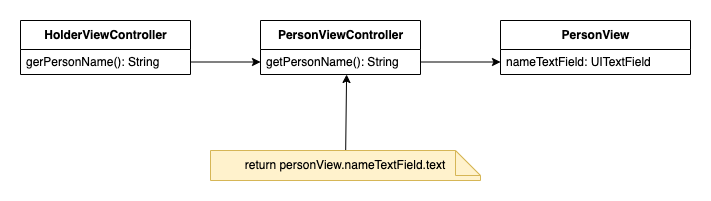

- [Técnicas de refatoração](#técnicas-de-refatoração)
- [Princípios de refatoração](#princípios-de-refatoração)
- [Por que refatorar?](#por-que-refatorar)
- [Quando refatorar](#quando-refatorar)
- [Quando não refatorar](#quando-não-refatorar)
- [Métodos para auxiliar na refatoração](#métodos-para-auxiliar-na-refatoração)
  - [Refatorações básicas](#refatorações-básicas)
    - [Extrair função](#extrair-função)
    - [Internalizar função](#internalizar-função)
    - [Extrair variável](#extrair-variável)
    - [Renomear variáveis](#renomear-variáveis)
    - [Introduzir objeto de parâmetros](#introduzir-objeto-de-parâmetros)
  - [Encapsulamento](#encapsulamento)
    - [Encapsular coleções](#encapsular-coleções)
    - [Substitur primitivo por objeto](#substitur-primitivo-por-objeto)
    - [Ocultar delegação](#ocultar-delegação)
  - [Movendo recursos](#movendo-recursos)
    - [Dividir laço](#dividir-laço)
    - [Substituir laço por pipeline](#substituir-laço-por-pipeline)
    - [Remover código morto](#remover-código-morto)
  - [Organizando dados](#organizando-dados)
    - [Mudar referência para valor](#mudar-referência-para-valor)
  - [Simplificando lógicas condicionais](#simplificando-lógicas-condicionais)
    - [Substituir cláusulas aninhadas por instruções de guarda](#substituir-cláusulas-aninhadas-por-instruções-de-guarda)
    - [Substituir condicional por polimorfismo](#substituir-condicional-por-polimorfismo)

# Técnicas de refatoração

Este é um repositório de estudo para documentar algumas das técnicas de refatoração de projetos de software descritos por Martin Fowler e Kent Beck no livro [Refatoração: Aperfeiçoando o Design de Códigos Existentes](https://www.amazon.com.br/Refatora%C3%A7%C3%A3o-Aperfei%C3%A7oando-Design-C%C3%B3digos-Existentes/dp/8575227246).

# Princípios de refatoração

É importante destacar que a refatoração não é bala de prata. Ela pode sim, juntamente com um bom design arquitetural e todos os princípios que governam o [SOLID](https://blog.cleancoder.com/uncle-bob/2020/10/18/Solid-Relevance.html) conduzir a um código limpo que seja fácil de manter e evoluir.

Se meu aplicativo está funcionando, por quê refatorar? Aqui cabe aquela velha máxima que muitos desenvolvedores já ouviram, mas poucos praticam. "Não escrevemos código para máquina, escrevemos código para outros desenvolvedores". Por mais clichê que possa parecer, no contexto atual é mais verdade do que nunca. Com o mercado de tecnologia muito aquecido, a rotatividade de profissionais é muito alta. Um código bem estruturado e fácil de entender diminui a curva de aprendizado de novos membros do time e o tempo para que este novo profissional possa produzir na mesma velocidade que os demais integrantes.

A refatoração não irá melhorar a performance da sua aplicação. Este não é o objetivo. A refatoração pode, inclusive, diminuir a performance da sua aplicação até certo ponto. A questão é que é muito mais fácil tratar questões de performance em um código bem estruturado do que em um código ininteligível.

Outro ponto importante destacado pelos autores é que o processo de refatoração deve manter o código no mesmo estado que estava antes de iniciar o processo. Para isso é fundamental a existência de testes unitários que deixem o desenvolvedor confiante de que a sua refatoração não irá introduzir novos bugs. Isso é o que os autores chamam de **comportamento observável**. 

Por isso, a refatoração deve ser composta de pequenos passos individuais, onde cada alteração é checada por testes de unidade.

Uma sugestão dos autores é tratar a refatoração de modo independente das demais atividades de desenvolvimento: novas funcionalidades, resolução de bugs, melhorias de performance, etc. O desenvolvedor pode até acabar resolvendo potenciais bugs ainda não identificados durante o processo de refatoração, mas esse não é o objetivo.

# Por que refatorar?

Olhando da perspectiva de um desenvolvedor essa pergunta parece ter uma resposta óbvia. No mundo real não cabe somente ao desenvolvedor decidir se o código deve ser refatorado e quando a refatoração deve acontecer. Ele precisa argumentar e defender a refatoração sob uma perspectiva de melhoria do produto e do projeto para poder convencer todas as partes interessadas.

Os autores destacam alguns pontos onde a refatoração gera resultados mensuráveis.

* **Refatoração para melhoria de design**: esse tipo de refatoração é importante para manter o código e a arquitetura do projeto sempre atualizados com as novas tecnologias e evoluções de plataforma. Sem esse tipo de refatoração o software "tende a entrar em decadência".

* **Refatoração para melhorar a legibilidade**: importante para deixar o código mais fácil de entender para todos os desenvolvedores que eventualmente precisarão atuar no código.

* **Refatoração para aumento de produtividade**: os dois pontos anteriores devem resultar neste terceiro, que é o que de fato interessa para todos os envolvidos. Quando o software é fácil de entender e está bem estruturado, sua manutenabilidade é baixa e sua evolução simples.

# Quando refatorar

A refatoração não é bala de prata e por isso é preciso ponderar sobre o melhor momento e método a ser utilizado para empregá-la.

Os autores apresentam diversas oportunidades e abordagens para aplicar a refatoração em código, destaco as seguintes:

* **Refatoração preparatória**: momento antes de iniciar o desenvolvimento de uma nova funcionalidade. O objetivo é "preparar o terreno" para não encontrar surpresas em tempo de cruzeiro. Neste ponto já existe conhecimento prévio sobre o código que será a base para a nova funcionalidade e que ele precisa ser modificado para receber novas evoluções.

* **Refatoração para compreensão**: aplicação da justificativa "para melhorar a legibilidade". Esse tipo de refatoração pode ser feita durante a resolução de um bug ou desenvolvimento de uma funcionalidade. Em geral não é preciso reservar um tempo exclusivo para realizar esse tipo de refatoração.

* **Refatoração para coleta de lixo**: variação da refatoração acima, no entanto, aplicado quando o desenvolvedor encontrar uma código com potencial de gerar bug, seja por fluxos não cobertos ou por lógicas incompletas.

* **Refatorações planejadas e oportunistas**: as refatorações mencionadas anteriormente são todas oportunistas, isto é, podem ser realizadas durante o desenvolvimento de uma nova funcionalidade ou resolução de um bug. Refatorações planejadas, por outro lado, exigem um tempo dedicado para atuação e normalmente são feitas de modo exclusivo. Esses tipos de refatorações devem ser muito bem analisadas e alinhadas com todos os envolvidos do projeto, a fim de definir expectativas do que será entregue após a sua realização (quais serão os ganhos reais para o projeto/produto).

# Quando não refatorar

Nem todo código "feio" precisa ser refatorado. Se o código existe há algum tempo e não precisa ser modificado, pois não prevê evolução, não é necessário refatorar. "A refatoração me trará alguma vantagem somente se eu precisa entender como o código funciona".

Outro caso onde não é aconselhado a refatoração é quando é mais fácil reescrever o código. Um exemplo prático é uma mudança de linguagem de programação dentro de um projeto. O mundo mobile tem proporcionado essa oportunidade com os não recentes suportes às linguages Kotlin para Android e Swift para os dispositivos da Apple. Muito além de simplesmente reescrever a mesma estrutura só que em uma linguagem diferente, essa é uma oportunidade de analisar o que pode ser melhorado e também explorar o potencial da nova linguagem empregada.

# Métodos para auxiliar na refatoração

Abaixo sumarizei, com exemplos do livro, os principais métodos de refatoração elencados pelos autores. Fica com *disclaimer* que mesmo os códigos refatorados podem possuir problemas. O objetivo não é ter um código perfeito ao final de cada refatoração mas sim,colocar em termos práticos os métodos de refatoração.

São mais de 60 métodos de refatoração com exemplos no livro, com antes e depois, e também com passos demonstrando como fazer cada refatoração. Não faria sentido replicar o que está no livro, para isso recomendo a leitura. Selecionei alguns que julgo serem relevantes e corriqueiros no dia-a-dia do desenvolvedor.

Outro ponto é que o autor divide as refatorações em tópicos, por exemplo: Primeiras refatorações; Encapsulamento; Refatorando API; Lidando com herança; Movendo recursos; Organizando dados e Simplificando lógicas condicionais.
Vale destacar também que muitos métodos de refatoração possuem etapas que utilizam outros métodos.

## Refatorações básicas

### Extrair função

Objetivo: extrair trecho de código em uma função ou método que seja coeso e autocontido.

Código a ser refatorado:

```swift 
public func printOwing(invoice: Invoice) {

    print("********************************")
    print("******* Customer Owns **********")
    print("********************************")

    var outstanding: Double = .zero
    for order in invoice.orders {
        outstanding += order.amount
    }
        
    print("name: \(invoice.customer)")
    print("amount: \(outstanding)")
}
```

Após a refatoração:

```swift 
public func printOwing(invoice: Invoice) {
    
    func calculateOutstanding() -> Double {
        return invoice.orders.reduce(0) { result, order -> Double in
            return result + order.amount
        }
    }
    
    func printDetails(outstanding: Double) {
        print("name: \(invoice.customer)")
        print("amount: \(outstanding)")
    }

    func printBanner() {
        print("********************************")
        print("******* Customer Owes **********")
        print("********************************")
    }

    let outstanding = calculateOutstanding()
    printBanner()
    printDetails(outstanding: outstanding)
}

```

### Internalizar função

Objetivo: remover acessos indiretos desnecessários.

Em geral é útil quando há muitos métodos que simplesmente chamam outros métodos. Essa "linkagem" de métodos ou funções só aumenta a carga cognitiva do desenvolvedor e dificulta o entendimento geral do programa.

Antes:

```swift
func getRating(for driver: Driver) -> Int {
    return moreThanFiveLateDeliveries(driver) ? 2 : 1
}

func moreThanFiveLateDeliveries(_ driver: Driver) -> Bool {
    return driver.numberOfLateDeliveries > 5
}
```

Depois:

```swift
func getRating(for driver: Driver) -> Int {
    return (driver.numberOfLateDeliveries > 5) ? 2 : 1
}
```

### Extrair variável

Objetivo: diminuir complexidade e melhorar legibilidade de expressões.

Sistemas podem demandar cálculos que compreendam vários passos e que possuem fórmulas padrões. Definir operandos como variáveis ajuda a entender os cálculos realizados e auxilia no processo de depuração e debug.

Antes: exemplo de cálculo usando uma entidade order.

```swift
func calculateFinalPrice(for order: Order) -> Double {
    return order.quantity * order.itemPrice - max(0, order.quantity - 500) * order.itemPrice * 0.06 + min(order.quantity * order.itemPrice * 0.1, 100)
}
```

Depois:

```swift
func calculateFinalPrice(for order: Order) -> Double {
    let basePrice = order.quantity * order.itemPrice
    let quantityDiscount = max(0, order.quantity - 500) * order.itemPrice * 0.06
    let shipping = min(order.quantity * order.itemPrice * 0.1, 100)
    let result = basePrice - quantityDiscount + shipping
    return result
}
```

### Renomear variáveis

Objetivo: facilitar a identificação de elementos envolvidos no código.

Definir bons nomes para variáveis é um desafio diário para o desenvolvedor. Este é também um dos principais pilares do Clean Code.
A maioria dos analisadores estáticos de código previnem o desenvolvedor de nomear variáveis com *X* e *bla*, mas isso não quer dizer que os nomes utilizados sejam bons para o contexto em que estão sendo utilizados.

Antes:

```swift
let usrNmStr = getUsername()
```

Depois:

```swift
let username: String = getUsername()
```


### Introduzir objeto de parâmetros

Objetivo: evitar repetição de parâmetros em diferentes métodos e diminuir o número de argumentos.

É comum que métodos ganhem novos argumentos à medida que novas features vão sendo desenvolvidas. Boas práticas sugerem um número pequeno de argumentos, no máximo 5.

Para resolver o problema de métodos com argumentos repetidos ou com muitos argumentos é útil criar estruturas de dados efêmeras, que fazem sentido somente para encapsular propriedades relacionadas, um **objeto de parâmetros**.

Antes:

```swift
func getOrdersSent(startDate: Date, endDate: Date) -> [Order]
func getOrdersCancelled(startDate: Date, endDate: Date) -> [Order]
func getOrdersPending(startDate: Date, endDate: Date) -> [Order]
```

Depois:

```swift
enum OrderStatus { case pending, sent, cancelled }

struct OrderRequest { 
    let status: OrderStatus
    let startDate: Date
    let endDate: Date
}

func getOrders(request: OrderRequest) -> [Order]

```

## Encapsulamento

Esta seção trata de estratégias para definir o que módulos devem ou não expor para os seus consumidores, através de refatorações.
Estruturas de dados em geral não devem ser expostas para outras partes do sistema e podem ser encapsuladas através de algumas das estratégias apresentadas abaixo.

Encapsular funções em classes específicas também facilita a compreensão do código e permite o reuso para situações comuns.

### Encapsular coleções

Objetivo: encapsular dados mutáveis em classes para facilitar o gerenciamento de quem os está alterando. Esse método também permite que a estratégia escolhida para armazenar os dados fique transparente para quem está usando a classe que encapsula, podendo ser alterada se necessário.

Exemplo: a classe `ShoppingCart` abaixo expõe uma variável `products` que pode ser alterada externamente. 

```swift
struct Product: Equatable {
    let name: String
    let price: Double
}

class ShoppingCart {
    var products: [Product] = .init()
}
```

Qualquer classe que possua uma instância de `ShoppingCart` pode adicionar e remover produtos sem o menor controle e conhecimento da estrutura responsável por armazenar a informação. Observe também que a estrutura de dados utilizada para armazenar os produtos é de conhecimento de instâncias fora da classe, o que pode gerar um problema se, no futuro, novas features exijam a alteração desse tipo.

Outro ponto de problema dessa abordagem é que, por se tratar de uma classe, `ShoppingCart` não é **thread safe**, pois ela não tem conhecimento das threads que podem alterar a sua propriedade `products`.

Uma forma de encapsular esses dados é mostrada abaixo:

```swift
struct ShoppingCart {
    private var _products: [Product] = .init()
    
    var products: [Product] {
        return _products
    }
    
    mutating func add(product: Product) {
        self._products.append(product)
    }
    
    mutating func remove(product: Product) {
        self._products.removeAll(where: { $0 == product })
    }
    
    mutating func clear() {
        self._products.removeAll()
    }
}
```

A agora `struct` `ShoppingCart` encapsula os métodos de manipulação dos produtos, aumentando assim o seu nível de controle sobre sua propriedade. A estrutura de dados da propriedade `_products` não precisa mais ser previamente conhecida por quem utiliza essa classe. Sabe-se que a classe expõe os dados para leitura através de um `Array`, mas isso não impede que a propriedade privada `_products` possa ser alterada para outro tipo sem impactar os utilizadores da classe `ShoppingCart`.

### Substitur primitivo por objeto

Esta técnica pode levantar muitos questionamentos à primeira vista, principalmente para novos programadores.
Mas ela está diretamente ligada ao conceito de [(*Value Object*)](https://martinfowler.com/bliki/ValueObject.html)

Objetivo: substituir tipos primitivos (inteiros, booleanos, strings), por objetos complexos.

Ao iniciar um desenvolvimento, parece fazer muito sentido representar, por exemplo, um número de CPF de um cliente em formato de string.

```swift
struct User {
    let cpf: String
}
```
Essa abordagem é perfeitamente aceita. O dado está pronto para ser exibido. Mas ela permite também que regras de validação estejam espalhadas por diferentes trechos de código, causando duplicação e aumentando a complexidade.

Criar um tipo específico para tratar **cpf** traz algumas vantagens.

```swift
struct CPF: Equatable {
    private let value: String
        
    var formattedValue: String {
        // return cpf with dots and dashes
    }
    
    var isValid: Bool {
        // perform cpf validations
    }
    
    var verifyingDigits: Int {
        // return the last two numbers
    }
}
```

A *struct* **CPF** encapsula a estrutura de dados de armazenamento do valor e fornece uma série de propriedades, que poderiam ser métodos em outras linguagens de programação, que podem ser reutilizadas em diferentes partes do código. 
Se futuramente, por exemplo, a forma de validação mudar, existirá apenas um ponto de alteração no código, diminuindo a chance de efeitos colaterais.

### Ocultar delegação

O principal objetivo do encapsulamento é esconder de módulos externos informações desnecessárias. Isso se torna mais complexo quando um módulo precisa expor informações que são de responsabilidade de um módulo ou classe internos.

Uma forma de fazer isso seria expor a classe para quem utiliza o intermediário. Suponha que tenhamos uma `ViewController` responsável por agregar alguns `ViewControllers` filhos. Esses filhos podem estar em um módulo separado. Suponhamos agora que a `ViewController` pai precise acessar alguma propriedade de um dos controllers filhos, por exemplo:


```swift

class PersonView: UIView {
    var nameTextField: UITextField?
}

class PersonViewController: UIViewController {
    var personView: PersonView?
}

class HolderViewController: UIViewController {
    
    var personViewController: PersonViewController = .init()
    
    func getPersonName() -> String? {
        return personViewController.personView?.nameTextField?.text
    }
    
}
```

O código acima pode ser representado pelo diagrama abaixo:


Da forma que foi construído, a classe `HolderViewController` precisa necessariamente saber o tipo e os métodos disponíveis em uma propriedade de `PersonViewController`. Com essa construção, qualquer alteração que for realizada na classe `PersonView` refletirá para fora do módulo, necessitando alterações em várias camadas.

Uma das formas de resolver esse problema é ocultar a propriedade interna de `PersonViewController` e simplesmente oferecer acesso às suas propriedades através de métodos ou propriedades públicas. Por exemplo:

```swift
class PersonView: UIView {
    var nameTextField: UITextField?
}

class PersonViewController: UIViewController {
    private var personView: PersonView?
    
    var personName: String? {
        return personView?.nameTextField?.text
    }
}

class HolderViewController: UIViewController {
    
    var personViewController: PersonViewController = .init()
    
    func getPersonName() -> String? {
        return personViewController.personName
    }
}
```

`HolderViewController` não precisa mais conhecer o tipo `PersonView`, podendo agora acessar sua propriedade através da variável `personName` na classe `PersonViewController`. Qualquer alteração que precise ser realizada na classe `PersonView` demandará adaptações somente até a classe `PersonViewController`, não afetando mais a classe do "módulo" externo.

A refatoração pode ser representada pela figura abaixo:



## Movendo recursos

### Dividir laço

### Substituir laço por pipeline

### Remover código morto

## Organizando dados

### Mudar referência para valor

## Simplificando lógicas condicionais

### Substituir cláusulas aninhadas por instruções de guarda

### Substituir condicional por polimorfismo


